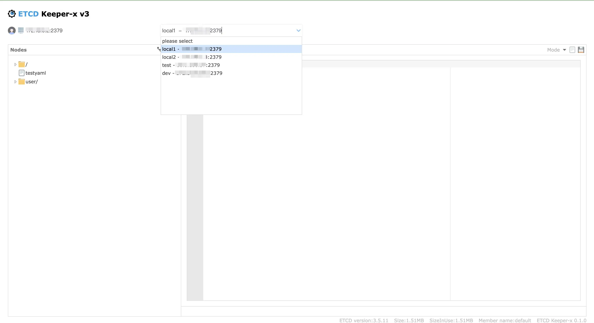

## ETCD Keeper-x
This is a fork of the original etcdkeeper project. The original project can be found [here](https://github.com/evildecay/etcdkeeper). Compared to the original version, this project has made the following changes:
* Removed support for etcd v2, retaining only support for etcd v3.
* Modified the display of the key list to show keys without the "/" prefix.
* Enhanced support for YAML format, including validation of YAML correctness.
* Improved etcd client reuse and proper recycling, reducing the number of connections between etcdkeeper and etcd.
* Configuration items are managed through a configuration file, with the startup parameter only supporting the `-c` parameter to specify the configuration file path. If the configuration file does not exist, a default configuration will be used.
* Multiple etcd addresses can be configured through the configuration file, and the current etcd address can be selected through a dropdown box. Direct editing of the etcd address for connection is also supported.

## Installation

### Prerequisites
- Go 1.22 or higher
- etcd v3

### Build from source
1. Clone the repository:
    ```sh
    git clone https://github.com/welllog/etcdkeeper-x.git
    cd etcdkeeper-x
    ```

2. Build the project:
    ```sh
    go build -o etcdkeeper-x
    ```

3. Run the project:
    ```sh
    ./etcdkeeper-x [-c config.yaml]
    ```

### Docker
1. Clone the repository:
    ```sh
    git clone https://github.com/welllog/etcdkeeper-x.git
    cd etcdkeeper-x
    ```
2. Build the Docker image:
    ```sh
    docker build -t etcdkeeper-x .
3. Run the Docker container:
    ```sh
    docker run -d -p 8010:8010 -v somepath:/cmd/etc etcdkeeper-x

## Configuration
The default configuration file is `config.yaml`, and the configuration file path can be specified using the `-c` parameter. Below is a sample configuration file (`config.yaml`):
```yaml
# etcdkeeper-x listen host
host: 0.0.0.0
# etcdkeeper-x listen port
port: 8010
# log level: debug, info, warn, error, fatal
loglevel:
etcds:
  # first default
    # etcd address
  - endpoints: 127.0.0.1:2379
    # etcd name
    name: default
    # key separator
    separator: /
    # tls config
    tls:
      enable: false
      certFile:
      keyFile:
      trustedCAFile:
  - endpoints: 127.0.0.1:23179
    name: backup
```

## Screenshots


## License
This project is licensed under the MIT License. See the [LICENSE](LICENSE) file for details.
